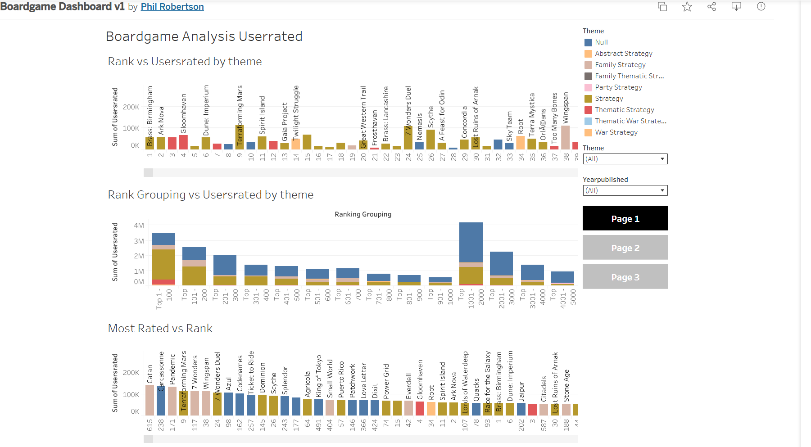
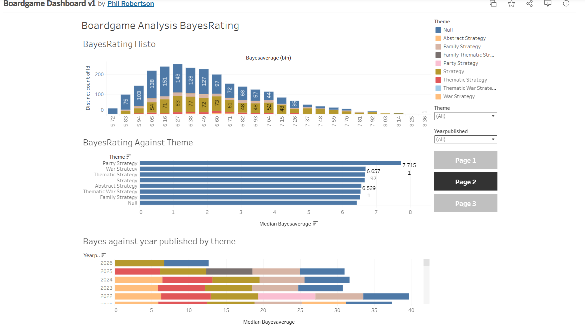
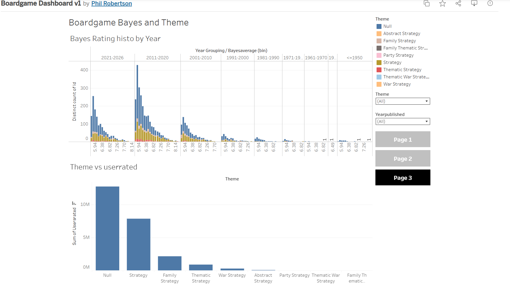

# My Portfolio

## Dashboard and Source of Main Dataset
[Dashboard](https://public.tableau.com/app/profile/phil.robertson/viz/BoardgameDashboardv1/BoardgameAnalysisUserrated?publish=yes)

[BGG](https://boardgamegeek.com)

## Publicly available dataset Project

### Executive Summary

This project utilises a dataset from BoardGameGeek (BGG), which data contains thousands of boardgames, to see what correlation could be utilised in business based decisions for the best type of game to publish understanding driving factors such as game popularity and user engagement within the boardgame market. The main objective is to interpret the user generated data (ratings, publication year, genre classification) into insights that would allow informed decision making. By using data science techniques including, data cleaning, exploratory data analysis and correlation assessment, the project will look for patterns that reveal how these metrics are related to average and Bayesian adjusted ratings. These insights could hopefully assist in prioritising resources, money and time so that demographics and recent trends are taken into consideration. Implementing data science lifecycle allowed this project to complete, this initial stage was an understanding of the desired outcome in terms of requirements that it would look at and analyse. In terms of data preparation while the main body of the data would be from bgg there are other sources that could assist in the analysis of this data. The bgg data required to be cleaned and reduced in terms of the meaningful data, there are entries for records more than once when there is a new edition, games older than would give any meaningful data, not everyone who plays games rates them and you can rate the game even if you have not played it as it’s based on public data entry, game entries not ranked enough to have a ranking and rankings below a certain number were meaningless so I limited most of the analysis to the top 5000. This approach ensured robust governance, reproducibility and iterative validation of findings. The analysis was then loaded into tableau and published for clear communication of both technical and non-technical users with an interactive dashboard that allowed the used to focus on a publishing period or game themes of a specific type allowing to align to user requirements.  Loading in the necessary dataset to tableau was one element and while there was additional data included such as 3 years’ worth of data of YouTube boardgame reviewers top ten lists it was not of a sufficient data standard to incorporate it all.  Ultimately, this project demonstrates how structure data analysis can drive measurable business value to aid in publishing decisions.

### Data Infrastructure and Tools

The data infrastructure for this project centres on managing and analysing the BoardGameGeek dataset which is a structured tabular dataset containing attributes such as game identifiers, publication year, user ratings, ranks, and genre classifications. This dataset’s relatively moderate size and structured nature make it well-suited for relational data ecosystems managed through Python tools. Python facilitates efficient data ingestion, cleaning, and preprocessing. Its supports handling null values, converting data types, and feature engineering such as calculating game age or identifying expansions. Visualization tools such as tableau provide scalable options for generating both static and interactive charts, aiding clear communication to mixed-technical audiences. While effective for datasets of this scale, public datasets often contain inconsistencies or missing data, requiring extensive validation. The static nature of the data limits real-time analytics, which could be addressed by incorporating streaming APIs, but at increased infrastructure complexity and this is not currently permitted by the data source owners. This project leverages Bayesian average rating techniques - a statistical method that balances rating volume and quality - reflecting advanced domain-specific analytics. Future integration of natural language processing (NLP) for sentiment analysis on user reviews and real-time data ingestion would enhance predictive power and market responsiveness. Aligning data infrastructure choices with business objectives ensures that insights directly inform game design optimisation and targeted marketing, driving competitive advantage in the evolving board game industry.

### Data Engineering

To support the analysis and user insight, the dataset was loaded in tableau. Tableau was selected due to it’s ability to handle structure data, support fast analysis and communicate through easy interactive dashboards. The dataset was exported from python as a clean analysis ready flat file and ingested directly into tableau using it’s in-built features. During this process the data was reviewed to ensure that the data types and categorical dimensions were correct (e.g. year of published and genre which was calculated in python if they had a theme rating in a specific category) in the tableau ingestion. This was important to enable accurate analysis, data filtering on age and rating. Following being ingested into tableau it was used to perform analysis, including time-series visulatisations of game publication trends, distribution of ratings and comparing theme of the board game within this as well and the impact it had on the rating as well as engagement. Filters allowed for testing, such as assessing whether high rated games consistently were rated by more people or if newer games are rated better than older titles due to more recent engagement. These insights informed subsequent engineering decisions and when and where it would be relevant to utilise Bayesian ratings. By taking this approach the project ensured that the data efforts were led buy analytical and goal oriented outcomes. This allows for more informed decisions and transparency to the user how the outcome is achieved.

### Data Visualisation & Dashboards

Data visualisation played a central role in translating complex analytical findings into clear, actionable insights for non-technical stakeholders, including publishers and designers. Tableau was selected as the primary visualisation platform due to its strength in interactive exploration, rapid aggregation, and its ability to present multi-dimensional data in an intuitive and accessible format. The visual tools were chosen to align with the subject matter and analytical objectives. Trend line charts were used to illustrate trends in board game publication and rating performance over time, enabling users to assess market evolution and lifecycle effects. Bar charts and ranked tables supported comparative analysis across themes, differences in popularity, engagement, and Bayesian ratings.  Dashboards were designed with clear visual hierarchy and logical sequencing, guiding users from high-level patterns to more granular theme common denominators. Consistent colour legends, annotations, and filters embedded clear communication guidelines, encouraging usage. By aligning visual elements directly with user questions and tailoring presentation to a decision based audience, the dashboards effectively allow technical analysis and data led decisions, ensuring that findings were both easy to understand and useful.

### Data Analysis

This analysis was guided by clearly defined hypotheses derived from the central data science question: which factors most strongly influence board game popularity and value.  The primary hypotheses tested were

Games with higher user engagement (measured by rating count) achieve stronger popularity rankings than those with similar average ratings but lower engagement
Certain boardgame themes systematically outperform others in Bayesian‑adjusted ratings.
Publication year influences ratings through both novelty and evergreen effects however going back far enough is impacted by the hobby being less popular and less games getting released.
These hypotheses ensured that analysis remained purpose-driven and aligned with user decision making needs. To evaluate these hypotheses, a structured experimental design was adopted, progressing from exploratory data analysis to inferential assessment. Correlation analysis was used to examine relationships between numerical variables such as rating counts, average ratings, Bayesian ratings, and rankings. Bayesian adjusted ratings were prioritised over simple averages to mitigate small sample bias, a known issue in user generated rating systems. Alternatively the approach could have been regression modelling and clustering however, correlation based analysis was selected for its interpretability and suitability given the project’s exploratory objectives and dataset scale. Findings revealed that rating volume exhibits a stronger association with ranking position than average rating alone however there are games that are outliers to this due to being older and a reduced game availability. Settlers of Catan is considered to be a dated and inferior game among experienced people in the hobby yet it is one of the most engaged titles. Genre-level analysis further demonstrated that strategy games tend to receive higher Bayesian ratings, informing product positioning and portfolio development decisions for publishers. This was the expected result given the popularity of Euro Strategy games and a reduction in purely thematic games. From a technical standpoint, these results were stable across multiple aggregation levels, increasing confidence in their robustness. From a decision-making perspective, the insights suggest that encouraging long-term engagement and targeting analytically proven genres can materially influence market success. There are outliers to this where games have exceeded sales such as Azul and Wingspan most likely explained by new people coming into the hobby and reaching a more commercial market that aren’t even aware that there is a website for rating games. The dataset consists of publicly available user generated data, reducing direct privacy risks. Methodological transparency and the use of bias correcting metrics such as Bayesian averages help mitigate unfair advantage toward highly rated but low engagement games. By adhering to principles of responsible data use, statistical integrity, and interpretability, the analytical approach balances commercial insight generation with data analysis.

